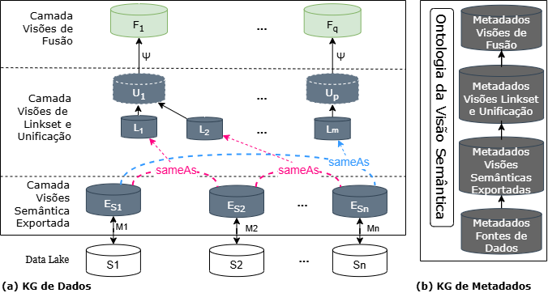
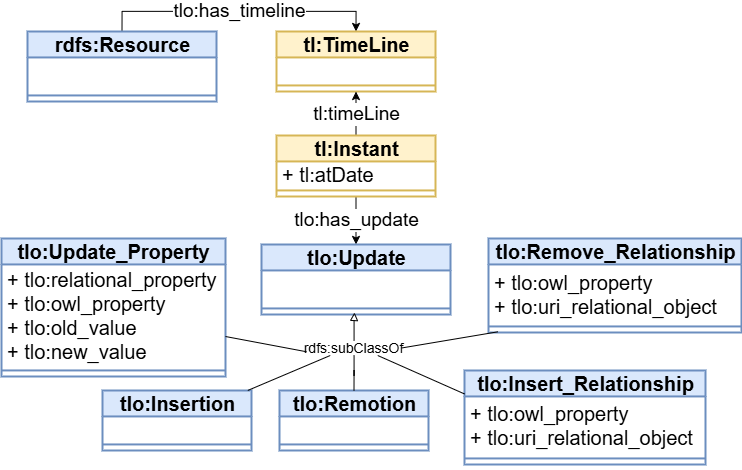

 
# ContextEKG_Explorer
### _A Tool for Context-Based Exploration of the Semantic View of Enterprise Knowledge Graphs_

ContextEKG_Explorer é uma aplicação web, desenvolvida com a biblioteca [React](https://breakdance.github.io/breakdance/), que renderiza as triplas dos grafos da visão semântica como componentes HTML. 
O diferencial dessa ferramenta é permitir que os usuários explorem entidades em múltiplos contextos, oferecendo diversas perspectivas sobre elas.

Suas principais _features_ incluem: 

- facilidade na descoberta de contexto;
- pode ser aplicada em qualquer domínio do conhecimento;
- consultas SPARQL otimizadas, ideais para explorar grafos em larga escala, incluindo grafos virtuais;
- facilitar a alternância da linguagem de preferência entre português e inglês nas consultas SPARQL. 


## Demonstração
Vídeo de demonstração da ferramenta no [Youtube](https://www.youtube.com/watch?v=czEKmBoBPzI).

Grafos de dados da visão semântica usado na demo: [grafos-musica-demo.zip](kgs-demo/grafos-musica-demo.zip) 

Grafo de metadados da visão semântica usado na demo: [ontologia-musica-br.trig](kgs-demo/ontologia-musica-br.trig) 


## Observações 
Para a visão semântica ser explorada com a _ContextEKG_Explorer_ ela deve ser construída com o nosso _Data Design Pattern_ (DDP) e observar algumas restrições:

### 1. Data Design Pattern



- Os recursos dos grafos de dados e metadados devem ter as propriedades _dc:identifier_ e _rdfs:label_. O _dc:identifier_ é para um controle interno e o _rdfs:label_ é o principal valor de exibição do recurso. 

- Não foi testada com BlankNodes.

### 2. Vocabulário Esperado pela Ferramenta
Para renderizar as triplas, a ContextEKG_Explorer espera alguns termos.

- Para as _timelines_, por exemplo, o grafo deve ser derivado da ontologia de timelines:



- Para a ontologia da visão semântica:

As classes das visões exportadas devem ter a propriedade _vskg:belongsToESV_ com _rdfs:range_ do tipo _xsd:string_, cujo valor deve ser exatamente o mesmo nome da fonte de dados. Um exemplo em Turtle seria:

```turtle
svm:MusicalArtist rdf:type owl:Class.
svm:MusicalArtist vskg:belongsToESV "Wikidata"
```

## API REST
A API da ferramenta desenvolvida como _framework_ FastAPI é disponibilizada no arquivo [contextEKG-api.zip](api/contextEKG-api.zip)

Para rodar a api o usuário deve descompactar o arquivo acima e executar o comando shell ```uvicorn main:app --reload```. 

Importante importar as bibliotecas de dependência como _Pytantic_, _Uvicorn_.


